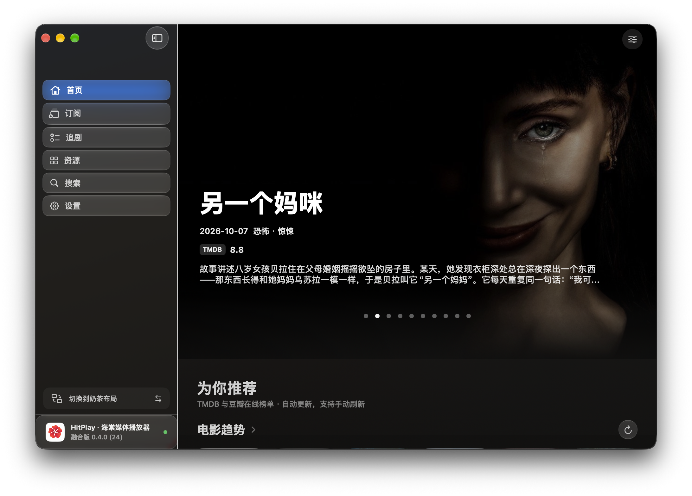
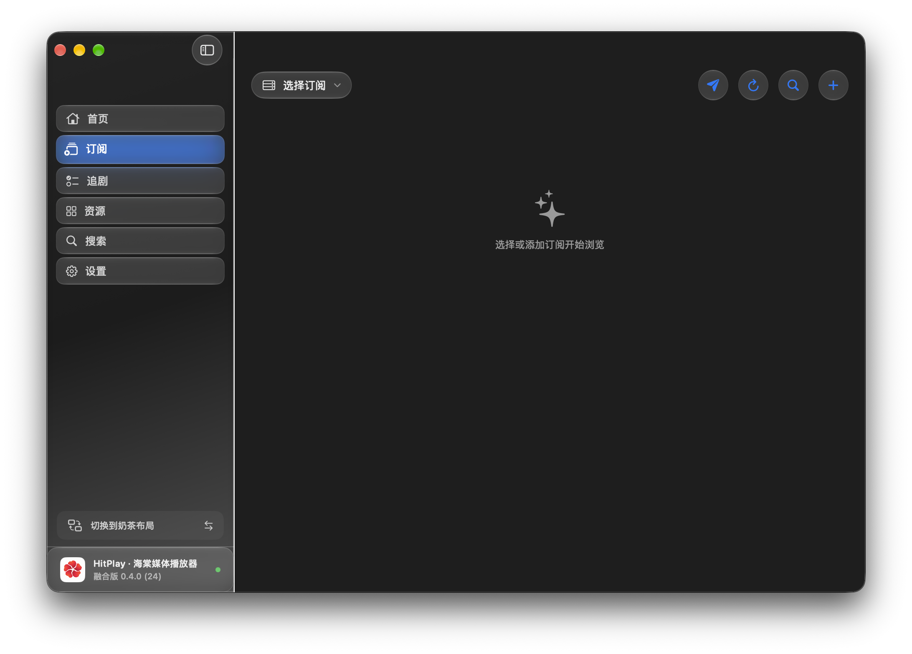
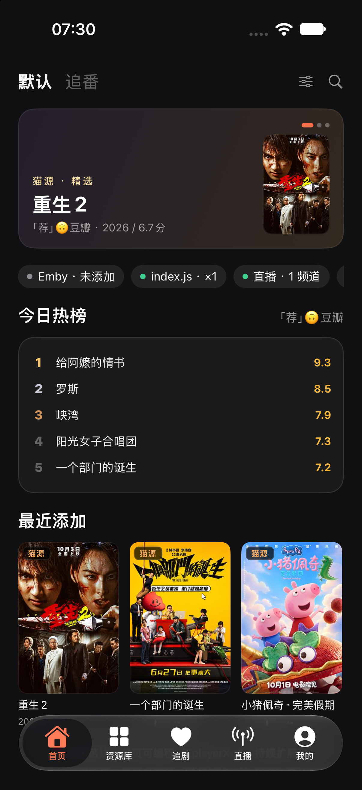
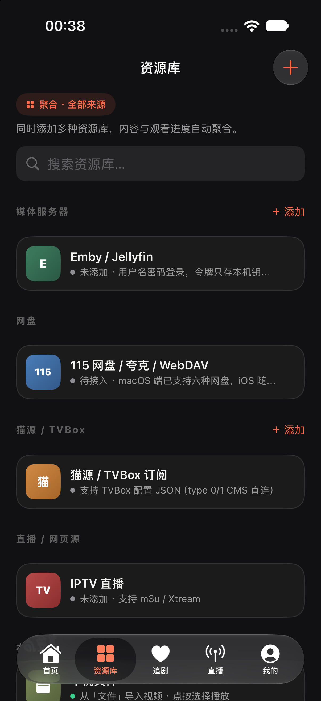
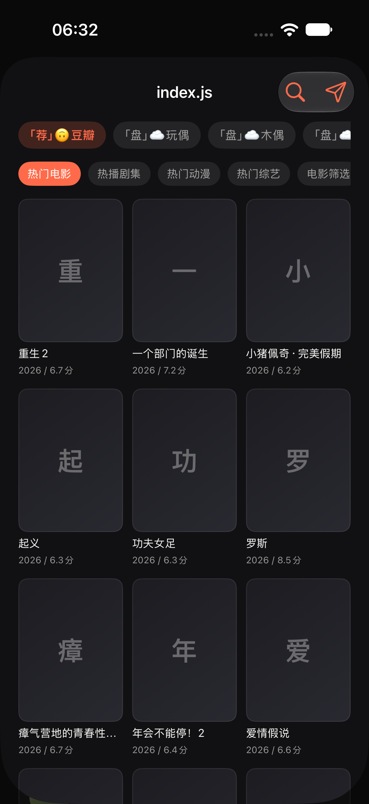

# HitPlay 海棠影音

### 面向 Apple 全平台的多源影音播放器

**猫源 / PY 源 / Emby 媒体库聚合 · macOS / iOS / tvOS · 自研播放内核 · 硬件加速解码**

HitPlay 把不同来源的影视内容放进一套清晰的浏览、搜索和播放体验。连接自己的猫源订阅或 Emby 媒体库，在熟悉的 Apple 设备上发现内容、选择线路、继续观看；播放时由系统媒体能力与 HitPlay 自研播放链路协同处理。

> 各平台功能根据设备形态和运行环境分别适配。猫源、PY 源、媒体服务器和播放能力并非每个平台都完全相同，详见下方平台支持表。

## 界面预览

### macOS

*macOS 融合版 0.4.0 (24) 实机截图。展示首页推荐、媒体内容和侧边栏导航。*

*macOS 融合版 0.4.0 (24) 订阅页实机截图。添加和切换订阅后，可从所选来源浏览内容。*

### iPhone / iPad

*iOS 端验收构建截图。包含推荐、来源状态、热榜和最近添加等内容区块。*

*iOS 端验收构建截图。集中管理媒体服务器、猫源订阅、直播和本地媒体入口。*

*iOS 端验收构建截图。可切换猫源站点与分类，并查看订阅提供的影片条目。*

## 核心特色

### 多来源汇聚，按自己的资源习惯观看

- **猫源订阅**：添加兼容的猫源 / TVBox 配置，浏览站点分类、搜索影片、查看详情并选择播放线路。
- **PY 源**：在 macOS 端安装并运行兼容的 Python 源，使用其分类、搜索、详情和播放能力。
- **Emby / Jellyfin 媒体服务器**：连接个人媒体库，浏览电影、剧集和分集，读取继续观看内容，并在支持的会话中同步播放进度。
- **聚合搜索与选源播放**：按已配置来源检索内容，以来源分组呈现结果；用户可以根据可用线路选择播放。不同来源条目是否合并显示，取决于条目匹配信息与当前平台功能。
- **本地与其他媒体入口**：macOS 端还支持本地文件、网页源、IPTV、STRM 等播放入口；具体入口随版本和平台变化。

HitPlay 是播放与来源管理工具，不内置影视内容。订阅地址、媒体服务器账号和播放权限由用户自行配置，并应确保拥有相应访问权。

### 三步开始观看

1. 在「资源」或「订阅」页面添加可用的猫源订阅 / PY 源，或连接自己的 Emby / Jellyfin 服务器。
2. 浏览来源分类，或在搜索页对已启用来源发起聚合搜索。
3. 打开影片详情，选择可用线路或剧集开始播放；支持的服务器会同步播放进度，方便之后继续观看。

### 自研播放内核，让复杂片源有合适的播放路径

桌面版集成 AVFoundation 系统播放路径、可选 MPV 兼容路径，以及基于 FFmpeg 的 HitPlay 自研播放链路。内核可按片源特征和设备能力选择后端；遇到已知不兼容封装时减少无效尝试，播放失败时按会话策略尝试回退。

自研播放链路将媒体解复用、VideoToolbox 硬件解码、Metal 视频输出与音频时钟接入统一会话。设备和片源支持时优先使用硬件解码；硬件路径不可用时尝试软件解码。硬解像素缓冲在支持的渲染路径中可直接映射至 Metal，减少 CPU 像素搬运。

### 主流格式广泛兼容

当前桌面版构建包含多种常见媒体能力，包括：

- **视频**：H.264、HEVC / H.265、VP9、AV1、MPEG-2，以及部分 AVS 系列编码。
- **音频**：AAC、AC-3、E-AC-3、TrueHD、DTS、FLAC、ALAC、MP3、Opus、Vorbis。
- **字幕**：ASS、SubRip / SRT 等文本字幕，以及部分字幕流格式。
- **封装与网络流**：MKV、MP4 / MOV、MPEG-TS / PS、HLS、AVI、OGG、WAV 等常见容器或协议。

“广泛兼容”不等于所有格式、编码参数和设备组合均可播放。硬件解码范围取决于芯片、操作系统和具体片源；无法使用硬解时会尝试软件解码。

### HDR、杜比格式与多声道

- **HDR 画面**：识别可用的 PQ / HLG 等色彩信息，按显示能力选择 HDR 呈现或 SDR 色调映射。已有 macOS arm64 环境下 4K HEVC Main10 HDR10 样片播放记录。
- **Dolby Vision 兼容播放**：可识别 Dolby Vision 片源并播放兼容基础画面层。当前没有完整的 RPU 动态元数据重塑链路，因此不承诺所有 Profile 均以原生 Dolby Vision 动态效果呈现。
- **杜比音频解码**：支持 AC-3、E-AC-3 与 TrueHD 等音频解码格式，并通过系统音频输出；最终声道效果取决于设备与连接方式。
- **Atmos 标记**：部分 E-AC-3 JOC 音轨可识别并显示 Atmos 标记。当前播放链路输出 PCM，尚无已验收的 Atmos 对象音频或无损 bitstream 透传保证。
- **多音轨 / 字幕**：在可用的片源轨道中切换语言和字幕，并尽可能在继续观看时恢复偏好。

格式解码能力不代表 Dolby 认证、徽标授权或设备端 Dolby Vision / Atmos 原生输出。

### 高效解码与低功耗设计

硬件解码优先、系统媒体后端、硬解帧直达 GPU 渲染、有界缓冲，以及内存 / 热状态 / 低电量压力下的负载调整，共同构成 HitPlay 的效率设计。目标是在兼容性、响应速度和资源占用之间取得平衡。

实际 CPU 占用、温度、续航和流畅度会随设备、片源、网络、显示器与播放后端而变化。当前公开验证包括指定设备上的样片端到端播放；尚无适用于所有设备的统一续航或性能对照数据，因此不作统一倍数承诺。

## 平台支持

| 功能 | macOS | iOS / iPadOS | tvOS |
| --- | --- | --- | --- |
| 猫源 / TVBox JS 订阅 | 支持 | 支持猫源 JS 浏览与播放 | 当前不提供 |
| PY 源 | 支持 | 当前不支持 Python 源运行时 | 当前不提供 |
| Emby / Jellyfin | 支持 | 支持 | 支持服务器浏览与播放 |
| 聚合搜索与内容浏览 | 猫源、PY 源、媒体服务器等按版本提供 | 猫源与媒体服务器等按版本提供 | 以连接的媒体服务器为主 |
| 本地与其他媒体入口 | 本地文件、网页源、IPTV、STRM 等 | 本地媒体及已接入来源 | 当前以媒体服务器内容为主 |
| 播放后端 | AVFoundation、HitPlay FFmpegCore、可选 MPV | AVFoundation / FFmpegCore 按发行构建提供 | 以平台系统播放路径为主 |

## 适用平台

- **Mac**：适合管理多个内容来源、订阅与媒体服务器，并使用桌面播放控制和本地媒体功能。
- **iPhone / iPad**：适合移动浏览、选源播放、继续观看和触屏播放器操作。iPad 随屏幕尺寸提供适配布局。
- **Apple TV**：适合连接 Emby / Jellyfin 后在电视大屏浏览电影与剧集，并使用遥控器进行焦点导航。

## 版本与开源边界

HitPlay 采用分层发布方式：猫源、PY 源等来源接入能力可按公开仓库范围开放；播放内核与 Emby 媒体服务器产品功能属于闭源产品组件。开源 Source Kit 不包含闭源播放内核或 Emby 客户端实现。第三方多媒体依赖遵循各自许可证。

截图来自开发和验收构建，用于展示当前界面与功能方向；不同发行版本、设备和用户配置下的实际画面可能不同。部分首页内容和片目来自已配置的数据源。

## 无签名测试包

仓库的 Release 页面提供 macOS 与 iOS 无签名测试包。两者均未签名、未公证：iOS IPA 需要测试者自行签名后安装；macOS 首次打开可能受到 Gatekeeper 限制。请查看 Release 说明与 SHA-256 校验文件。

[下载 HitPlay 0.4.0 (24) 无签名测试包](https://github.com/chchok/HitPlay/releases/tag/test-0.4.0-24-unsigned)

## 贡献者

- [chchok](https://github.com/chchok)

## 交流与反馈

欢迎加入 HitPlay Telegram 群组，交流使用体验、反馈问题与建议：
[加入 Telegram 群组](https://t.me/+JOriPW0sSdpiYTQ9)

---

*HitPlay 海棠影音：把不同来源的内容，带到你常用的 Apple 屏幕上。*
